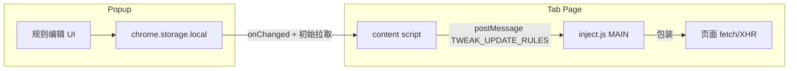

# API 模拟扩展 — 详细开发计划

## 现状与 PRD 差距

| 维度 | PRD / Demo | 当前代码 |
|------|------------|----------|
| 配置入口 | 仅 [src/popup/](src/popup/) | Popup 为纯 Demo，未接 [src/storage.ts](src/storage.ts) |
| 规则模型 | Label、URL 前缀、Method（含 `*`）、Delay、Request/Response/Headers、status、单条开关 | [src/types.ts](src/types.ts) 仅 `urlPattern/method/status/responseBody/active/delayMs`，缺 label、headers、request body |
| URL 匹配 | **前缀**（完整 URL） | [src/content/inject.js](src/content/inject.js) 使用 `includes` 或 `/regex/` |
| Mock 判定 | **Response payload 非空** 才 Mock；否则可改写请求并发网 | 有 rule 即 Mock，未区分空 body |
| 请求改写 | 非 Mock 时用 Request payload（首版建议 **整段替换** body） | 未实现 |
| 响应头 | Mock 时使用配置的 Response headers | 写死 `Content-Type: application/json` |
| 全局开关 | Play 关闭则完全不拦截 | 未实现（需随规则一并下发） |
| 多规则命中 | 列表顺序，**第一条命中即停** | `find` 顺序一致，但需过滤 `active` + 全局开关 + Mock 语义 |
| 页面内 UI | PRD：Side Panel 不做配置；避免双入口 | [src/content/main.tsx](src/content/main.tsx) 仍挂载 [src/content/views/App.tsx](src/content/views/App.tsx) 浮层，与「仅 Popup」冲突 |

---

## 阶段 1：数据模型与 Popup 真功能（MVP 配置面）

**目标**：持久化规则 + 全局开关；Popup 可增删改、与 Demo 布局一致但字段可编辑并写入 storage。

1. **扩展存储结构**（建议键名稳定、可版本化）  
   - `rules: Rule[]`  
   - `globalEnabled: boolean`（默认 `true`）  
   - 可选：`schemaVersion: number` 便于日后迁移。

2. **定义 `Rule` 类型**（在 [src/types.ts](src/types.ts) 或 `src/shared/rule.ts`，供 Popup 与 content 序列化共用）  
   - `id`, `label`, `urlPrefix`, `method`（`'GET'|'POST'|...|'*'`）, `delayMs`, `statusCode`, `requestPayload`, `responsePayload`, `responseHeaders`（多行文本）, `enabled`（单条开关）。  
   - 与现有 `MockRule` 对齐迁移路径：读 storage 时兼容旧字段（`urlPattern`→`urlPrefix`，`responseBody`→`responsePayload`，`active`→`enabled`）。

3. **实现 [src/storage.ts](src/storage.ts)**  
   - `getState()` / `setState()` 或细粒度 `getRules` + `setRules` + `getGlobalEnabled`；保持与现有 `onChanged` 监听兼容。

4. **改造 [src/popup/App.tsx](src/popup/App.tsx)**  
   - 用 `useEffect` 加载 storage；所有变更 `debounce` 或失焦保存（避免 textarea 每次按键写盘过频）。  
   - 移除或缩小「演示专用」文案；保留 **全局 Play**、**规则开关**、展开区三字段；**导出/导入**可按 PRD v1.2 放到阶段 3，或 MVP 顺手用 JSON 文件实现（与旧版逻辑类似）。  
   - **校验**：Response payload 若填了可尝试 `JSON.parse` 提示（与 PRD「非空即 Mock」一致，非法 JSON 仍允许以纯文本 Mock 需产品决定——计划建议：Mock body 允许纯文本，JSON 仅警告）。

5. **Side Panel**（[manifest.config.ts](manifest.config.ts)）  
   - PRD：不承担配置。最小改动：[src/sidepanel/App.tsx](src/sidepanel/App.tsx) 改为简短说明「点击工具栏图标打开 Popup 配置」，避免与 Popup 双写规则。

---

## 阶段 2：注入层与 PRD 行为对齐（MVP 拦截面）

**目标**：页面请求行为与 PRD 3.3、决策记录一致；content 将「全局开关 + 规则列表」同步到 inject。

1. **统一匹配函数**（建议抽到共享模块，inject 构建时内联或 duplicate 最小逻辑）  
   - **URL**：请求 URL 字符串以 `urlPrefix` 为前缀（实现前固定一种 **尾斜杠** 策略，与 Popup 占位提示一致）。  
   - **Method**：规则为 `*` 或与方法大小写不敏感相等。  
   - **启用**：`globalEnabled && rule.enabled`。  
   - **优先级**：数组索引升序，`find` 第一个命中。

2. **改写 [src/content/inject.js](src/content/inject.js)**（或改为 TS 打包进单文件，若你愿意增加构建步骤；否则保持 JS 并与类型注释同步）  
   - **Mock 路径**（`responsePayload.trim().length > 0`）：`delay` → `new Response(body, { status, headers })`，headers 由多行 `Key: Value` 解析（跳过空行/非法行）；缺省可补 `Content-Type`。  
   - **非 Mock 路径**：若有 `requestPayload`，在调用 `originalFetch` 前替换 body（注意 `Request` 对象需 clone/`new Request`）；**XHR**：在 `send` 中若需改写，用规则 body 替换 `args[0]`（Document 类型需明确不支持或跳过）。  
   - **全局关闭**：收到规则快照中 `globalEnabled === false` 时直接走原始 fetch/XHR。

3. **改造 [src/content/main.tsx](src/content/main.tsx)**  
   - `sendRulesToPage` 改为发送 `{ globalEnabled, rules }`（或扁平结构），inject 侧相应解析。  
   - **移除** 或注释掉向 `document.body` 注入 React 浮层（`crxjs-app`），减少与 PRD 冲突及性能干扰；若需调试浮标，可用单独 dev flag。  
   - 保留 `postMessage` + `storage.onChanged`；评估将初始 `setTimeout(100)` 改为 `inject.onload` 回调内发送，降低竞态。

4. **Manifest 权限**  
   - 当前 `script` 注入 + `web_accessible_resources` 可继续满足；若未来改用 `chrome.scripting.executeScript({ world: 'MAIN' })` 再增加 `scripting`。本计划默认 **不新增权限** 除非遇 CSP 阻断再评估。

---

## 阶段 3：打磨与测试（v1.1 / v1.2 对齐）

1. **导入/导出**（PRD 3.4 / 里程碑 v1.2）  
   - Popup 导出当前 `rules` + `globalEnabled` JSON；导入校验结构后写入 storage。

2. **本地 fixture**  
   - 增加 `fixtures/mock-demo.html`（或 Vite public 页）：对已知前缀发起 `fetch` 与 `XHR`，用于手工验收 Delay、Mock、改写。

3. **单元测试**（PRD 5.5）  
   - 对「前缀 + Method + 首条命中 + Mock 判定」抽纯函数，Vitest 测；inject 层可 e2e 仅手工或后续 Playwright。

4. **日志与文档**  
   - 生产环境减少 `console.log`；在 [README.md](README.md) 写明限制：仅 `fetch`/XHR、CSP 极端场景可能失效、页面脚本可篡改同世界钩子（开发工具定位）。

---

## 风险与顺序建议

- **XHR Mock/改写** 行为差异大（同步 `responseText`、`readystatechange` 顺序）；MVP 可先保证 **fetch** 全路径正确，XHR 分步补齐并 fixture 验证。  
- **Request 对象**：`fetch` 传入不可变 `Request` 时需规范 `new Request(url, { ...init, body })` 的复制字段，避免丢失 method/headers。

## 建议排期（可并行度）

- 阶段 1 与阶段 2 的「匹配函数 + 类型」可先定稿，再并行：一人做 Popup+storage，一人做 inject+content（需先约定 message payload 形状）。  
- 阶段 3 在端到端跑通后再做。
