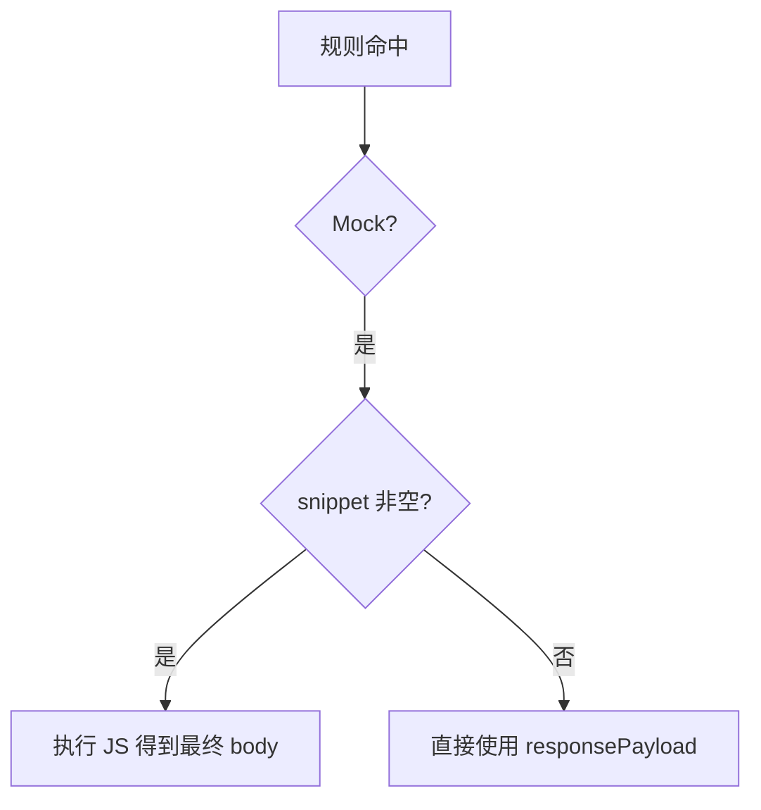

# Custom JavaScript snippets（对齐 Tweak Response hook）

## 参考行为（与文档一致的部分）

根据 [Tweak — Response hook](https://tweak-extension.com/docs/rule/javascript-snippet)：

- **Mock rule**：真实响应不会到达浏览器；脚本收到的 **`response` 来自规则里配置的响应体**（本项目中即 **Response payload**），而不是服务器数据。
- **上下文变量**：`response`（object 或 string）、`url`、`method`、`body`（请求体字符串）、以及文档中的 `vars`、`chance`、`_`（lodash 的 `merge` / `pick` / `isEqual`）。

当前实现（[`src/content/inject.js`](src/content/inject.js)）在 Mock 分支直接 `return new Response(rule.responsePayload, ...)`，**尚未**在透传分支对 `originalFetch` 的响应执行脚本（对应文档流程里「第 6 步」）。

## 1. 数据模型与迁移

- 在 [`src/shared/rule.ts`](src/shared/rule.ts) 的 `Rule` 上新增 **`responseSnippet: string`**（默认 `''`）。
- 在 `migrateOneRule` / `createEmptyRule` 中补默认值，保证从 storage 与导入 JSON 读入的旧数据兼容（无需升 `SCHEMA_VERSION` 除非你要区分导出格式版本）。

## 2. 执行语义（inject 与类型共用一套约定）

建议在 [`src/shared`](src/shared) 新增 **`responseSnippetRunner.ts`**（或类似命名），职责拆分：

| 职责 | 说明 |
|------|------|
| **`response` 的解析** | 对 `responsePayload` 做 `trim` 后尝试 `JSON.parse`；失败则 **`response` 为整段字符串**（与 Tweak「object \| string」一致）。 |
| **用户代码形态** | 与文档示例一致：代码体 **`return`** 表达式/值（例如 `return _.merge(response, {...})`），**不是** `function(){...}` 包一层。 |
| **返回值落地** | `return` 为对象/数组 → `JSON.stringify`；`string` → 原样；`undefined` → **回退为未执行脚本的 `responsePayload`**（避免静默丢数据）；其它原始类型可 `String()` 或统一 JSON 化（实现时二选一并写清）。 |
| **异常** | `try/catch`：`console.error('[gadget-mock] response snippet', err)`，并 **回退到原始 `responsePayload`**。 |

**注入变量（首版建议）**

- 必做：`response`, `url`, `method`, `body`
- `body` 获取方式：
  - **fetch**：从 `config` 读取；仅可靠支持 **字符串 / `URLSearchParams` / `Blob`（`text()`）**；`ReadableStream` 可文档注明「不支持或尽力读」以免引入大量异步包装。
  - **XHR**：与现有 `send` 改写一致，在 `send` 调用时把 **传入的字符串参数**作为 `body`（与当前改写路径一致）。

**`vars` / `chance` / `_`**

- **`vars`**：首版 **`{}`** 或固定空对象，便于日后接「扩展变量」。
- **`chance`**：文档依赖 [chance.js](https://chancejs.com/)。若在页面 inject 里静态打包 chance，会明显增大注入脚本体积。**首版推荐**：`chance` 为 **占位空对象或仅 `noop` 方法**，在 Popup 文案中说明「与 Tweak 完全一致的 chance 后续可加」；若你坚持一致，再增加依赖并在构建时把极小子集打进 inject（成本更高）。
- **`_`**：实现 **`merge`（建议浅/深合并到满足文档 `_.merge` 示例即可）**、`pick`、`isEqual` 三个方法，可写在 inject 同文件的小工具对象上，**不引入 lodash 全量**。

**执行方式**：在 **页面 MAIN world** 使用 `new Function('response','url','method','body','vars','chance','_', userCode)` 调用（与扩展上下文隔离；用户脚本与 Tweak 一样在页面侧执行，需在 README 做安全提示）。

## 3. 修改 [`src/content/inject.js`](src/content/inject.js)

- 抽一个 **`runResponseSnippet(rule, url, method, bodyStr)`**（内部调上述语义），返回 **最终字符串 body**。
- **Mock + fetch**：`delay` → 若 `responseSnippet` 非空则计算 body，否则保持现状。
- **Mock + XHR**：同样在 `runMock` 里用最终字符串设置 `response` / `responseText`。
- **非 Mock**：首版 **不改动**（保持与现 PRD 一致）；若做第二阶段见下文。

## 4. Popup / 编辑器 UI

- 在 [`src/popup/PayloadTabsEditor.tsx`](src/popup/PayloadTabsEditor.tsx) 增加第四 Tab：**「Response snippet」**（或「JS」），编辑 `rule.responseSnippet`。
- 使用 CodeMirror：新增依赖 **`@codemirror/lang-javascript`**，该 Tab 用 JS 高亮（与现有 JSON/Headers 并列）。
- 在 Tab 下增加简短说明文案：变量列表、Mock 时 `response` 来源、出错回退行为；可链到 Tweak 文档作为「行为参考」。
- [`src/popup/App.tsx`](src/popup/App.tsx) 把新字段传入 `PayloadTabsEditor` 并在 `onFieldChange` 中更新。

## 5. 类型与共享逻辑

- [`src/shared/matchRule.ts`](src/shared/matchRule.ts) 的 `isMockEnabled` **不必**因 snippet 改变（仍以「非空 Response payload」判定 Mock，与 PRD 一致）；**仅当**你希望「无 payload、仅 snippet 也 Mock」时再单独讨论（会改变产品语义，本计划默认 **不** 改）。

## 6. 测试与验证

- 在 [`src/shared`](src/shared) 为 **解析 / 序列化 / 回退策略** 增加单元测试（不一定要在 Node 里 `new Function` 执行完整 snippet，可测纯函数部分）。
- 手动：用 [`fixtures/mock-demo.html`](fixtures/mock-demo.html) 或本地页验证：Mock + snippet 修改 JSON 字段；snippet 抛错时仍返回原 payload。

## 7. 可选第二阶段：透传路径的「真实 Response hook」（fetch only）

若需对齐文档中 **非 Mock** 时「第 6 步传入真实 HTTP 响应」：

- 仅在 **`originalFetch` 分支**：命中规则、**非 Mock**、且 **`responseSnippet` 非空** 时，`await originalFetch(...)` 后 `clone().text()` → 将文本解析为 `response` 再跑同一套 runner → `new Response(transformed, ...)`。**顺序**：先应用现有 Request payload 改写，再发网，再跑 snippet。
- **XHR** 要实现同等能力需大量封装（监听 `load`、改写 `responseText` 等），建议 **首版明确不支持** 或在文档标为仅 fetch。

---

## 关键文件一览

- 模型/迁移：[`src/shared/rule.ts`](src/shared/rule.ts)
- 新逻辑：新建 `src/shared/responseSnippetRunner.ts`（再被 inject 侧复制逻辑或构建时内联 —— 与现有 **inject 手写 duplicate matchRule** 一致，保持 [`src/content/inject.js`](src/content/inject.js) 与 TS **行为一致**）
- 拦截：`src/content/inject.js`
- UI：`src/popup/PayloadTabsEditor.tsx`、`src/popup/App.tsx`、`package.json`（`@codemirror/lang-javascript`）
