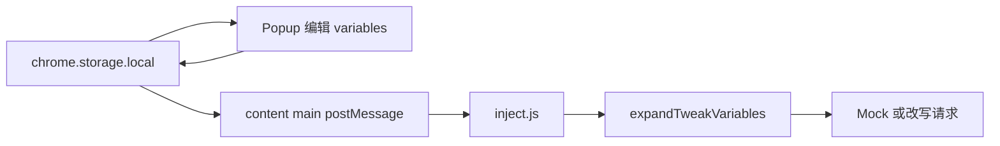

# Custom Variables（对齐 Tweak Variables）

## 文档要点

参考 [Tweak — Variables](https://tweak-extension.com/docs/variables)：

- 变量名：仅 **字母、数字、下划线**。
- 插值语法：`$tweak.var.<VARIABLE_NAME>`，可在 Response/Request payload、Headers、Response hook 等编辑器中引用。
- 「伪 JSON」中可写 `"timestamp": $tweak.var.timestamp`（无引号包裹表达式）以插入数值/布尔；带引号形式 `"$tweak.var.x"` 表示字符串场景。
- Response hook 脚本内通过 **`vars`** 访问（如 `vars.first_name`），与插值是两条路径：插值在文本层先展开，hook 内 `vars` 为结构化对象。

## 数据模型与存储

- 在 [`src/shared/rule.ts`](src/shared/rule.ts)（或新建 `src/shared/variables.ts`）定义 **`TweakVariables`**：`Record<string, string>`（键为变量名，值为用户输入的**原始字符串**，便于存数字/布尔字面量或 JSON 片段）。
- 在 [`STORAGE_KEYS`](src/shared/rule.ts) 增加 **`variables`**（或 `customVariables`），默认 `{}`。
- 扩展 [`ExtensionState`](src/shared/rule.ts)：`variables: TweakVariables`。
- [`src/storage.ts`](src/storage.ts)：`getExtensionState` / `setExtensionState` 读写 `variables`；`onChanged` 监听需包含新键（[`src/content/main.tsx`](src/content/main.tsx) 已有 `changes.rules || changes.globalEnabled`，扩展为 `changes.variables`）。

## 插值算法（共享模块 + 单测）

新建 [`src/shared/tweakVariables.ts`](src/shared/tweakVariables.ts)（命名可微调）：

| 步骤 | 行为 |
|------|------|
| 1 | 先替换 **带引号** 的整段：`"$tweak.var.NAME"` → `JSON.stringify(该变量字符串值)`（与 Tweak「整段 token 在引号内」一致）。 |
| 2 | 再对剩余文本用正则替换 **`$tweak.var.NAME`**（`NAME` 为 `[A-Za-z0-9_]+`）：未定义则保留原 token 或保留为字面（二选一并写清，建议 **保留原样** 便于排查）。 |
| 3 | **无引号**位置：将存储值 `trim` 后尝试 `JSON.parse`；若为 `number` / `boolean` / `null` 则输出 `JSON.stringify` 结果（即合法 JSON 字面量）；否则 `JSON.stringify` 整段字符串。 |

为 **snippet 的 `vars` 参数** 提供 `parseVariablesForHook(raw: TweakVariables): Record<string, unknown>`：对每个值尝试 `JSON.parse`，失败则保留原字符串，以便 `vars.timestamp` 为数字等。

**单元测试**（Vitest）：引号内字符串、无引号数字、未知变量、空表。

## 页面注入（[`src/content/inject.js`](src/content/inject.js)）

- 增加全局 `tweakVariables = {}`；在 `TWEAK_UPDATE_RULES` 处理中读取 `d.variables`（对象校验后合并）。
- 实现与 TS **行为一致**的 `expandTweakVariables(text, tweakVariables)`（复制自 shared 逻辑）。
- **使用点**（凡参与网络/Mock 的字符串，在读取规则字段后立刻展开）：
  - `responsePayload`、`requestPayload`、`responseHeaders`。
  - **Mock + snippet**：先将 **展开后** 的 payload 作为 `responseRaw` 传给 `runResponseSnippet`（修正当前「snippet 仍用未展开 payload」的语义，与 Tweak「先插值再 hook」一致）；`runResponseSnippet` 增加参数 **`vars`** = `parseVariablesForHook(tweakVariables)`。
- **透传 fetch + snippet**：真实响应体无需变量插值；仅把 `vars` 传入 snippet。

## Response snippet 运行器（[`src/shared/responseSnippetRunner.ts`](src/shared/responseSnippetRunner.ts)）

- `RunResponseSnippetOptions` 增加可选 **`hookVars?: Record<string, unknown>`**（默认 `{}`）。
- `inject.js` 中调用时传入解析后的 `hookVars`。

## Popup UI

- [`src/popup/App.tsx`](src/popup/App.tsx)：状态增加 `variables`；hydrate / debounce 持久化与 `rules`、`globalEnabled` 并列；导入导出 JSON 包含 **`variables`**（与现有 `schemaVersion` / `rules` 并列）。
- 新增小组件（如 `VariablesEditor.tsx`）或内联区块：**表格**「变量名 + 值」、**添加行 / 删除行**；名称输入校验 `[A-Za-z0-9_]+`，非法时提示或禁止保存。
- [`src/popup/PayloadTabsEditor.tsx`](src/popup/PayloadTabsEditor.tsx) 或规则区底部：简短说明 `$tweak.var.<name>` 与 [Tweak Variables 文档](https://tweak-extension.com/docs/variables) 链接。

## 文档

- [`README.md`](README.md)：说明全局变量、插值语法、与 snippet 中 `vars` 的关系及未知变量行为。

## 数据流示意

## 关键文件

- [`src/shared/rule.ts`](src/shared/rule.ts) / [`src/storage.ts`](src/storage.ts)
- 新建 [`src/shared/tweakVariables.ts`](src/shared/tweakVariables.ts) + `tweakVariables.test.ts`
- [`src/content/main.tsx`](src/content/main.tsx)、[`src/content/inject.js`](src/content/inject.js)
- [`src/shared/responseSnippetRunner.ts`](src/shared/responseSnippetRunner.ts)
- [`src/popup/App.tsx`](src/popup/App.tsx) + 新 UI 组件与样式
