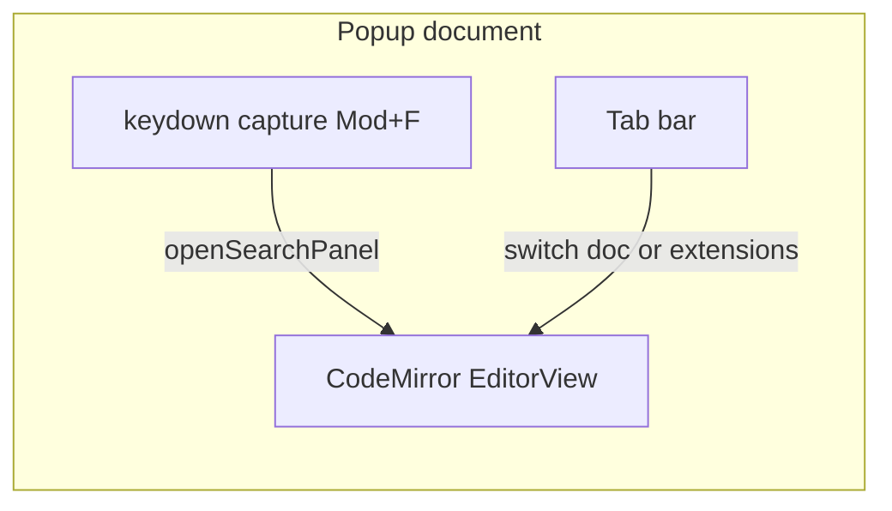

# Popup 样式与编辑器增强计划

## 现状

- 宽度由 [src/popup/App.css](src/popup/App.css) 中 `.demo-app { width: 400px }` 与 [src/popup/index.css](src/popup/index.css) 中 `html, body { min-width: 400px }` 共同约束。
- 详情区为三个纵向 [`<textarea>`](src/popup/App.tsx)（Request / Response / Headers），无高亮、无格式化、无编辑器内搜索。
- 依赖仅有 React（[package.json](package.json)），需新增编辑器相关包。

## 技术选型

采用 **CodeMirror 6**（`@codemirror/view`、`@codemirror/state`、`@codemirror/lang-json`、`@codemirror/search`、`@codemirror/commands` 等），理由：

- 体量明显小于 Monaco，更适合扩展 popup。
- 内置 **搜索面板**（`openSearchPanel` / `closeSearchPanel`）与 **JSON 语法高亮**（`@codemirror/lang-json`）。
- Format：`JSON.stringify(JSON.parse(text), null, 2)`，非法 JSON 时沿用现有提示风格（可 `alert` 或沿用 `jsonHint` 文案）。

Headers 页内容为 `Key: value` 行文本，**不用 JSON 语言包**，使用同一套暗色主题 + 等宽字体即可（避免误报 JSON 错误）。

可选封装：使用社区包 **`@uiw/react-codemirror`** 减少样板代码；若更在意依赖可控性，可在组件内 `useRef` + `EditorView` 自建挂载（二选一，实现时择一即可）。

## UI 结构（你已选 Tab 布局）

在 [`App.tsx`](src/popup/App.tsx) 的规则展开区（`demo-card__detail`）内：

1. **Tab 条**：`Response payload` | `Request payload` | `Response headers`（与参考图一致；文案可中英并存或保持现有字段语义）。
2. **Tab 右侧工具栏**：
   - **Format**：仅当当前 Tab 为 Request/Response 时启用；对当前文档执行美化，失败则提示。
   - **Copy**：将当前 Tab 对应字符串写入剪贴板（`navigator.clipboard.writeText`），失败时降级提示。
3. **下方主体**：单实例编辑器区域，随 Tab 切换更换 `EditorView` 的文档或切换受控 `value` + `extensions`（Request/Response 用 `json()`，Headers 用基础扩展即可）。切换 Tab 时保留各 Tab 文本在 state 中（仍写回 `rule.*`），避免丢内容。

视觉：延续现有暗色渐变与边框风格，在 [App.css](src/popup/App.css) 中为 Tab、工具栏、编辑器容器增加样式；CodeMirror 使用 `EditorView.theme({...})` 或 `@codemirror/theme-one-dark` 再微调以贴近当前 `#0f0f12` 系配色。

## 宽度

- 将 `.demo-app` 与 `html, body` 的 `min-width` 一并提高到 **约 560–640px**（实现时取一值，例如 600px），并适当提高 `max-height` 或编辑器 `min-height`，让长 JSON 可编辑性接近参考图。
- Chrome popup 会随内容扩展，一般 **≤800px 宽** 可接受；若实测被裁切再回调数值。

## Cmd/Ctrl+F 接管策略

在 popup 文档上注册 **`window.addEventListener('keydown', handler, true)`**（捕获阶段）：

- 当 `(e.metaKey || e.ctrlKey) && e.key === 'f'`：`e.preventDefault()` + `e.stopPropagation()`，对**当前获得焦点的 CodeMirror `EditorView`** 调用 `openSearchPanel(view)`（来自 `@codemirror/search`）。
- 维护 `lastFocusedEditorRef`：在每个 `EditorView` 的 `EditorView.domEventHandlers` 或 `focus` 监听里更新，以便在焦点在 Tab/按钮上时仍有一个合理目标（例如默认落到 Response 对应 view）。
- 可选：`Escape` 时若搜索面板打开则 `closeSearchPanel`（CodeMirror 默认行为常已覆盖，实现时以实测为准）。

这样可避免浏览器在 popup 内抢占「查找」行为，满足「在 popup 打开时顶替默认 Command+F」的需求。

## 文件改动清单

| 文件 | 改动 |
|------|------|
| [package.json](package.json) | 增加 CodeMirror 相关依赖（及可选 `@uiw/react-codemirror`） |
| 新建 `src/popup/PayloadTabsEditor.tsx`（或 `components/` 下） | Tab + 工具栏 + 三个逻辑文档与 CM 实例/扩展切换、Format/Copy、焦点 ref |
| [src/popup/App.tsx](src/popup/App.tsx) | 用新组件替换 `demo-card__detail` 内三个 `textarea`；传入 `rule` 片段与 `updateRule` |
| [src/popup/App.css](src/popup/App.css) | Tab/工具栏/编辑器高度、加宽后的间距 |
| [src/popup/index.css](src/popup/index.css) | 同步 `min-width` |

## 验证

- 本地 `npm run build` 确认打包与类型检查通过；手动在 Chrome 加载扩展后：打开 popup → 展开规则 → 切换 Tab → Format 合法/非法 JSON → Cmd+F 出现编辑器内搜索且页面级查找不出现（或不再优先）→ 复制按钮可用。

